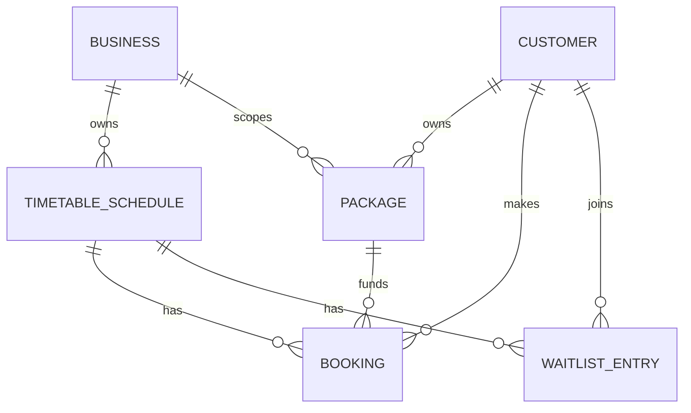

# Database schema

| Table | Key columns | Purpose |
| --- | --- | --- |
| Businesses | Id, Name | Tenant boundary |
| Customers | Id, Name, Email | Email is unique |
| Packages | CustomerId, BusinessId, TotalCredits, RemainingCredits, ExpiresAtUtc | Credit source |
| Schedules | BusinessId, StartTimeUtc, EndTimeUtc, Capacity | Class capacity |
| Bookings | CustomerId, TimetableScheduleId, PackageId, Status | Audit history, including cancellations |
| WaitlistEntries | CustomerId, TimetableScheduleId, Status, JoinedAtUtc | FIFO queue |

Indexes cover package eligibility, business/schedule time, active bookings, and waitlist FIFO ordering. Schedules and bookings also have EF row-version columns.
